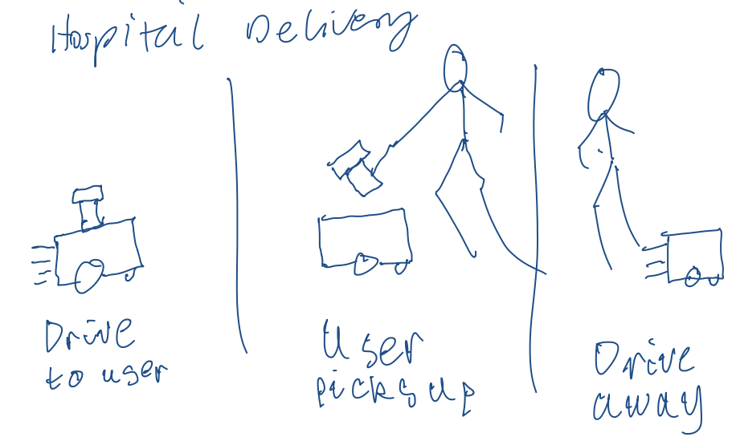
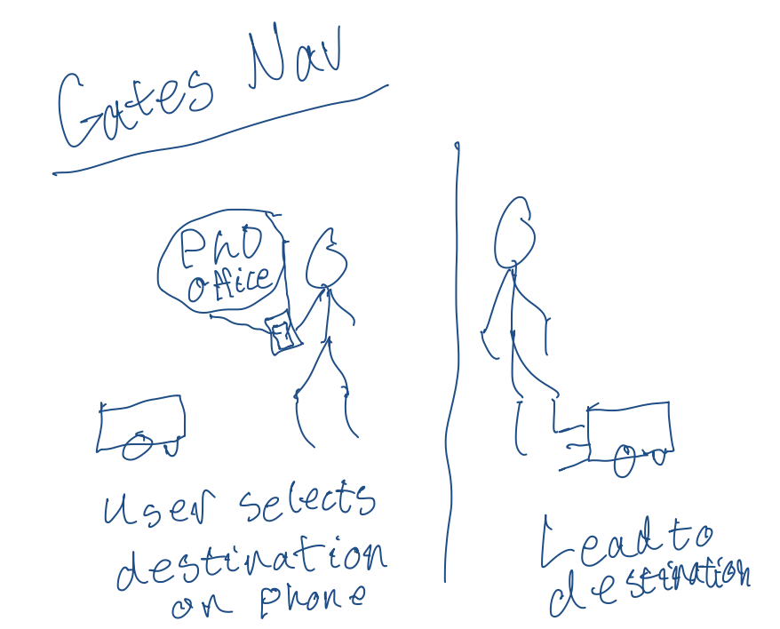
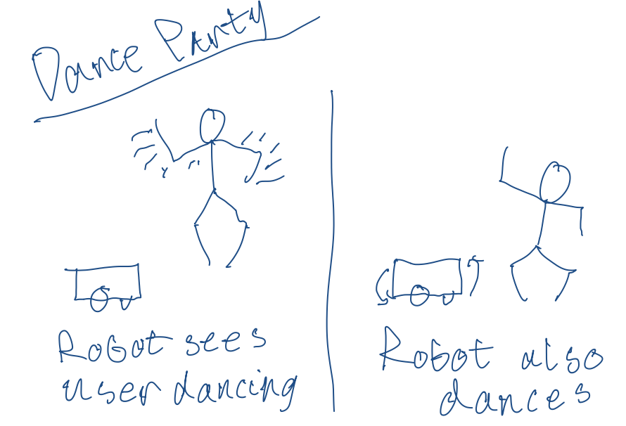
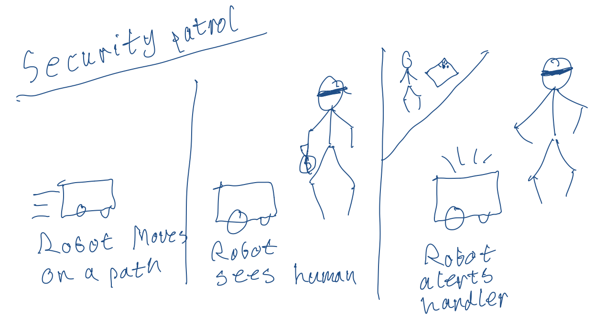
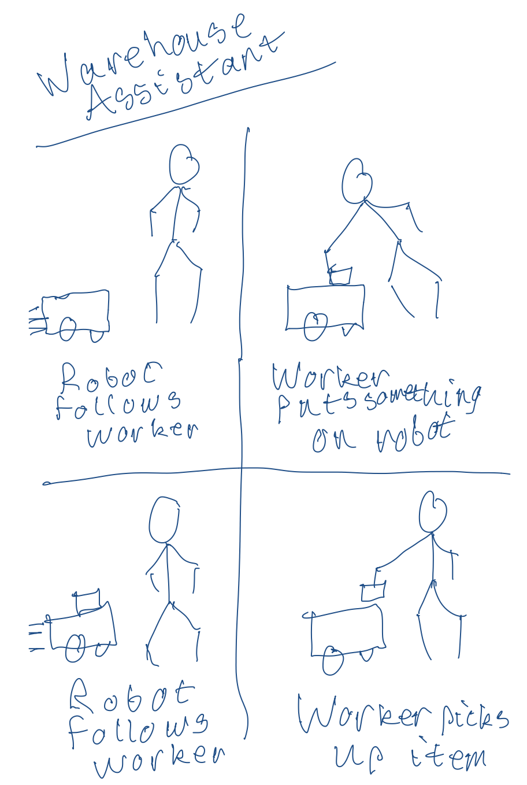

# Interaction First
\*\***Qian (Martin) Meng (qm34), Nhan Tran (nt322), Andrew Violette (amv78)**\*\*


## Lab Report
For this assignment, you are going to:

A) [Build Your Clonebot](#part-a-build-your-clonebot)

B) [Plan](#part-b-plan) 

C) [Act out the interaction](#part-c-act-out-the-interaction) 

### Deliverables for this lab are: 
1. 5 Storyboards
2. Any reflections you have on the process
3. Video sketch of 3 prototyped interactions (selected from the 5 storyboards)
4. Submit the items above in the Lab1 folder of your class [Github page], either as links or uploaded files. **Each group member should have the updated lab page linked to their own Lab Hub.** Better yet, you could replicate the data in your own repo so that you don't lose anything if your partner modifies or deletes their files later.

### The Report

## Part A. Build Your Clonebot
Please see Part C for the robot.

## Part B. Plan 

To stage an interaction with your CloneBot, think about:

_Setting:_ Where is this interaction happening? (e.g., an office, the kitchen) When is it happening?

_Players:_ Who is involved in the interaction? Who else is there? Reflect on the design of current day home mobile robots like Roomba. Think through all the people who are in the setting.

_Activity:_ What is happening between the actors?

_Goals:_ What are the goals of each player? (e.g., picking up a pen, opening the fridge). 

Leverage the possible motions of Clonebot and the extra degree of freedom provided by the motor on the top.

\*\***Describe your setting, players, activity and goals here.**\*\*
#### 1. Hospital Delivery
- Players: Robot, Patient
- Activity: Robot delivers medication to patient 
- Goals: Both want the human to have the medication
- 

#### 2. Gates Hall Navigator
- Players: Robot, New PhD Student
- Activity: Robot guides PhD student to the 1st year Phd Lab
- Goals: New student wants to go to 1st year phd lab
- 

#### 3. Dance Party Bot (in Gates Hall)
- Players: Robot, Bored PhD Student
- Activity: Student dances, then robot dances in response
- Goals: Want to have fun!

- 

#### 4. Security Patrol (in Gates Hall)
- Players: Robot, Robber, Guard
- Activity: Robot sees robber, calls guard
- Goals: Robber wants to get away unseen, guard wants to catch robber
- 

#### 5. Warehouse Assistant
- Players: Robot, Warehouse Worker
- Activity: Robot follows worker around, worker puts items on robot for later use
- Goals: Warehouse worker wants to free up their hands

- 


## Part C. Act out the Interaction

Select 3 of the 5 storyboards to act out. Try physically enacting the 3 interactions you planned with your teammates. (Do not plug in the CloneBot just yet.) Record these video clips, and submit them (Unlisted Youtube links are fine).

#### 1. Robot Dance Party

YouTube: http://www.youtube.com/watch?v=BFkunMsG0do


\*\***Are there things that seemed better on paper than acted out?**\*\*
-  Fancy dance moves (e.g., backflip) that would be easier to draw on paper but difficult to act out.

\*\***Are there new ideas that occur to you or your collaborators that come up from the acting?**\*\*
- The robbt should sense the kind of dance and try to synchronize with the tempo as well as the human's choreography.


#### 2. Hospital Robot

YouTube: https://www.youtube.com/watch?v=c_fL64GuzLU


\*\***Are there things that seemed better on paper than acted out?**\*\*
-  Drawing how the robot would approach the user and carry the load without tipping itself over.

\*\***Are there new ideas that occur to you or your collaborators that come up from the acting?**\*\*
- After observing that the robot would tip over when transporting medical supplies, we hope to figure out a better way to distribute the load and make the robot more balanced during delivery.


#### 3. Gates Hall Robot Navigator

YouTube: https://www.youtube.com/watch?v=DjWNq2EmqCU


\*\***Are there things that seemed better on paper than acted out?**\*\*
-  Drawing how the robot would approach the user and carry the load without tipping itself over.

\*\***Are there new ideas that occur to you or your collaborators that come up from the acting?**\*\*

- Since the robot doesn't have a mic, we decide to equip it with a QR code so that users can scan and go to a web interface in order to tell the robot where they want to go.


## Your Weekly Dose of ROS

We are not quite finished with the lab from last week.

As I mention, ROS is managed through packages. We have this crazy file structure that looks like a python package but haven't really made a package.
In the last bit of today's lab, let's actually build our package.

Go back to the construct website and log in to your previous Rosject.

In your code editor, open the file `mobilehri_ws/src/my_package/setup.py`.

Replace what's inside with the following code snippet.

```python
from setuptools import setup

package_name = 'my_package'

setup(
    name=package_name,
    version='0.0.0',
    packages=[package_name],
    data_files=[
        ('share/ament_index/resource_index/packages',
            ['resource/' + package_name]),
        ('share/' + package_name, ['package.xml']),
    ],
    install_requires=['setuptools'],
    zip_safe=True,
    maintainer='user',
    maintainer_email='user@todo.todo',
    description='TODO: Package description',
    license='TODO: License declaration',
    tests_require=['pytest'],
    entry_points={
        'console_scripts': [
            'talker = my_package.hri_publisher:main',       # NEW!
            'listener = my_package.hri_subscriber:main',    # NEW!
        ],
    },
)

```

By adding entry points that linked to the main functions in our hri_publisher and hri_subscriber files, we basically create shortcuts for ROS to call our script in Terminal. 

Now, let's build our package. Open a terminal:
``` bash
cd ~/mobilehri_ws/
colcon build          # ignore the warning/err about setup.py being deprecated.
source install/setup.bash
```

Remember that we need to source ROS every time? In order to use your customized ROS packages, you must source them individually as well! To do so, source the setup.bash file within `workspace/install`.

Now, you can call your scripts through ROS the following way:

```bash
# In terminal 1
cd ~/mobilehri_ws/
source install/setup.bash
ros2 run my_package talker
```

```bash
# In terminal 2
cd ~/mobilehri_ws/
source install/setup.bash
ros2 run my_package listener
```

You may notice that the listener does not receive messages published before it is created. As Wendy mentioned in class, the messaging system established through publishers and subscribers are not reliable. They are in fact asynchronous. Publishers are unaware of the subscribers existence. 

To have a more reliable interaction, you will need a new type of mechanism called service and client. We will talk more about this later. 
